# git教程1--如何操作本地仓库（保姆级教程，好上手）

> 原创 于 2021-11-06 00:13:03 发布 · 3.9w 阅读 · 71 · 191 · CC 4.0 BY-SA版权 版权声明：本文为博主原创文章，遵循 CC 4.0 BY-SA 版权协议，转载请附上原文出处链接和本声明。
> 文章链接：https://blog.csdn.net/TroyeSivanlp/article/details/121172010

前言：这几天学习了一下git操作，简单的给大家讲讲怎样使用。
此文章一共分为两节：

1. [git教程1–本地仓库中的操作](https://blog.csdn.net/TroyeSivanlp/article/details/121172010)

2. [git教程2–远程仓库中的操作](https://blog.csdn.net/TroyeSivanlp/article/details/121173204)

**本地仓库中的操作**

[TOC]


### 一.安装git之前要了解：Git基础概念

#### 1.什么是 Git

`Git` 是一个 **开源的分布式版本控制系统** ，是目前世界上 **最先进** 、 **最流行** 的版本控制系统。可以快速高效地处理从很小到非常大的项目版本管理。

#### 2.Git中的三个区域

使用 `Git` 管理的项目，拥有三个区域，分别是 **工作区** 、 **暂存区** 、 **`Git` 仓库** 

#### 3. Git 中的三种状态

- **已修改 `modified`** 

  - 表示修改了文件，但还没将修改的结果放到 **暂存区**

- **已暂存 `staged`** 

  - 表示对已修改文件的当前版本做了标记，使之包含在 **下次提交的列表中**

- **已提交 `committed`** 

  - 表示文件已经安全地保存在本地的 **Git 仓库中**

**注意：** 

- 工作区的文件被修改了，但还没有放到暂存区，就是 **已修改** 状态。

- 如果文件已修改并放入暂存区，就属于 **已暂存** 状态。

- 如果 Git 仓库中 **保存着特定版本** 的文件，就属于 **已提交** 状态。

### 二.安装并配置 Git

#### 1.在 Windows 中下载并安装 Git

在开始使用 `Git` 管理项目的版本之前，需要将它安装到计算机上。可以使用浏览器访问如下的网址，根据自己

的操作系统，选择下载对应的 `Git` 安装包： [https://git-scm.com/downloads](https://git-scm.com/downloads) 

#### 2.配置用户信息

安装完 `Git` 之后，要做的第一件事就是设置自己的 **用户名** 和 **邮件地址** 。因为通过 `Git` 对项目进行版本管理的时候， `Git` 需要使用这些基本信息，来记录是谁对项目进行了操作。不管在哪个位置，都可以，鼠标右键,“ `Git Bash` ” ，输入如下命令：

```
git config --global user.name "你的名字"
git config --global user.email "你的邮箱"
```

**注意：**如果使用了 --global 选项，那么该命令只需要运行一次，即可永久生效。

在这里我就不展示了，设置过了。

#### 3.检查配置信息

除了使用记事本查看全局的配置信息之外，还可以运行如下的终端命令，快速的查看 Git 的全局配置信息：

```shell
# 查看所有的全局配置项
git config --list --global
# 查看指定的全局配置项
git config user.name
git config user.email
```

效果展示：
 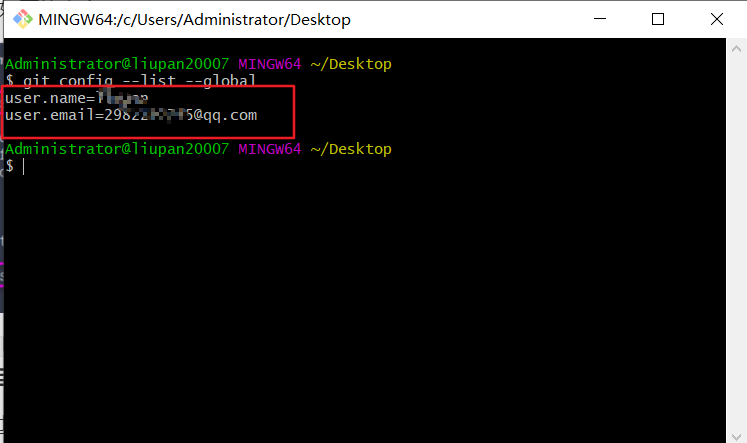

### 三.Git 的基本操作

#### 初始化仓库(⭐⭐⭐)

现在F盘里创建一个文件夹demoProject,文件夹中建一个index.html。
 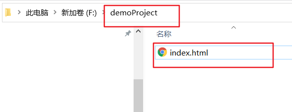

① 在项目目录中，通过鼠标右键打开“ `Git Bash` ”

② 执行 `git init` 命令将当前的目录转化为 `Git` 仓库

`git init` 命令会创建一个名为 .git 的隐藏目录， **这个 .git 目录就是当前项目的 Git 仓库** ，里面包含了 **初始的必要文件** ，这些文件是 Git 仓库的 **必要组成部分** 

效果展示：
 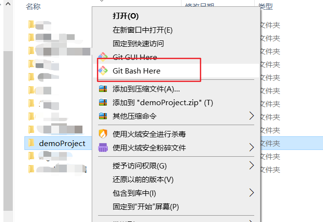

 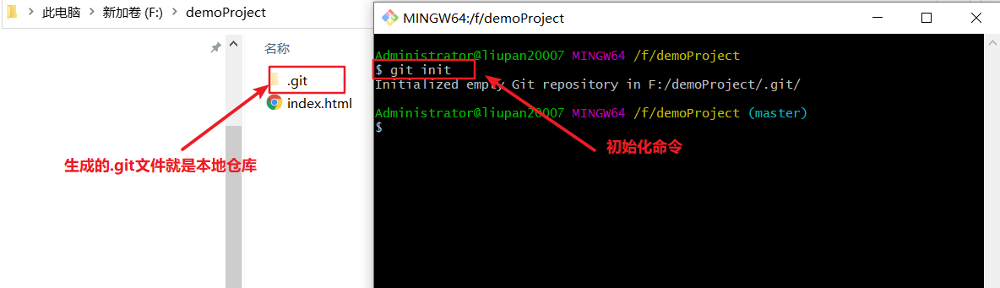

#### 检查文件的状态(⭐⭐⭐)

使用 `git status` 输出的状态

 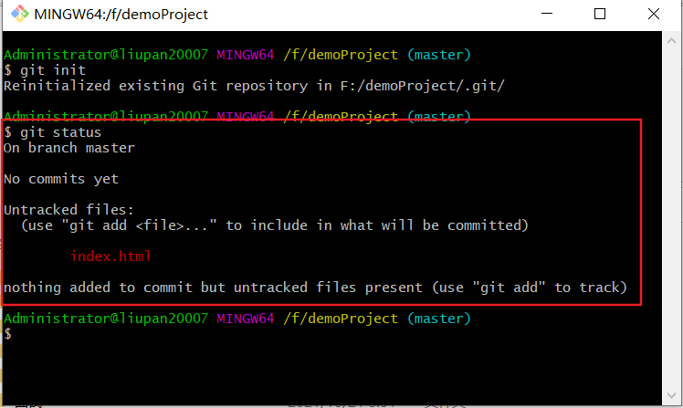

#### 以精简的方式显示文件状态

使用 `git status` 输出的状态报告很详细，但有些繁琐。如果希望以精简的方式显示文件的状态，可以使用如下

两条完全等价的命令，其中 **-s** 是 **–short** 的简写形式：

```shell
# 以精简的方式显示文件状态
git status -s
git status --short
```

未跟踪文件前面有红色的 **??** 标记，例如：

 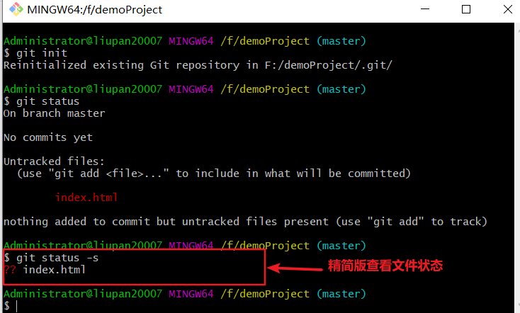

#### 跟踪新文件(⭐⭐⭐)

使用命令 `git add` 开始跟踪一个文件。 所以，要跟踪 `index.html` 文件，运行如下的命令即可：

```shell
git add index.html
# 如果文件过多，你项跟踪目录下所有文件
git add *.*
```

此时再运行 `git status` 命令，会看到 `index.html` 文件在 `Changes to be committed` 这行的下面，说明已被跟踪，并处于暂存状态：
 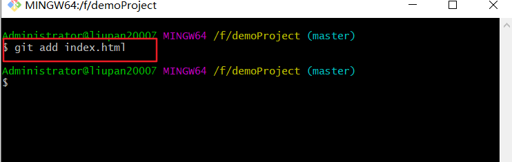

#### 提交更新(⭐⭐⭐)

现在暂存区中有一个 `index.html` 文件等待被提交到 `Git` 仓库中进行保存。可以执行 `git commit` 命令进行提交,其中 `-m` 选项后面是本次的提交消息，用来对提交的内容做进一步的描述：

```shell
git commit -m "新建了index.html 文件"
```

提交成功之后，会显示如下的信息：

 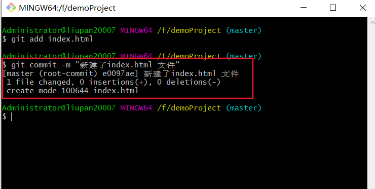

#### 对已提交的文件进行修改

目前， `index.html` 文件已经被 `Git` 跟踪，并且工作区和 `Git` 仓库中的 `index.html` 文件内容保持一致。当我们修改了工作区中 `index.html` 的内容之后，再次运行 `git status` 和 `git status -s` 命令，会看到如下的内容：

文件 `index.html` 出现在 `Changes not staged for commit` 这行下面，说明 **已跟踪文件的内容发生了变化，但还没有放到暂存区** 。

**注意：**修改过的、没有放入暂存区的文件前面有红色的 **M** 标记。
 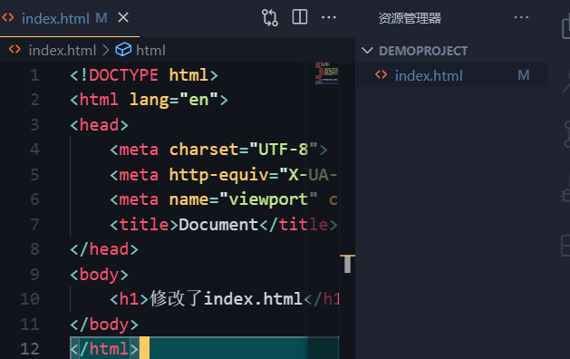

 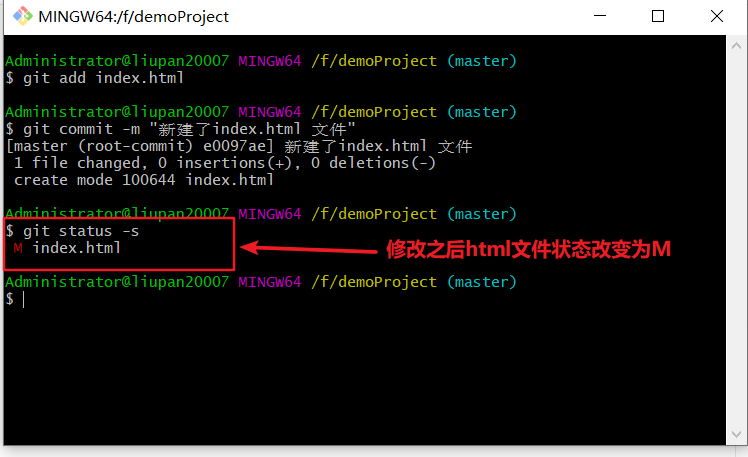

#### 暂存已修改的文件

目前，工作区中的 `index.html` 文件已被修改，如果要暂存这次修改，需要再次运行 `git add` 命令，这个命令是个多功能的命令，主要有如下 3 个功效：

① 可以用它 **开始跟踪新文件** 

② 把 **已跟踪的** 、 **且已修改** 的文件放到暂存区

③ 把有冲突的文件标记为已解决状态

#### 提交已暂存的文件

再次运行 `git commit -m "提交消息"` 命令，即可将暂存区中记录的 `index.html` 的快照，提交到 `Git` 仓库中进行保存：
 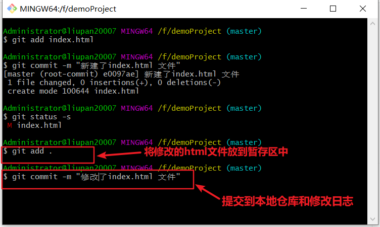

#### 向暂存区中一次性添加多个文件

如果需要被暂存的文件个数比较多，可以使用如下的命令，一次性将所有的新增和修改过的文件加入暂存区：

```shell
git add .
```

新建一个index.js和index.css,并且把他们引入到index.html文件中。
 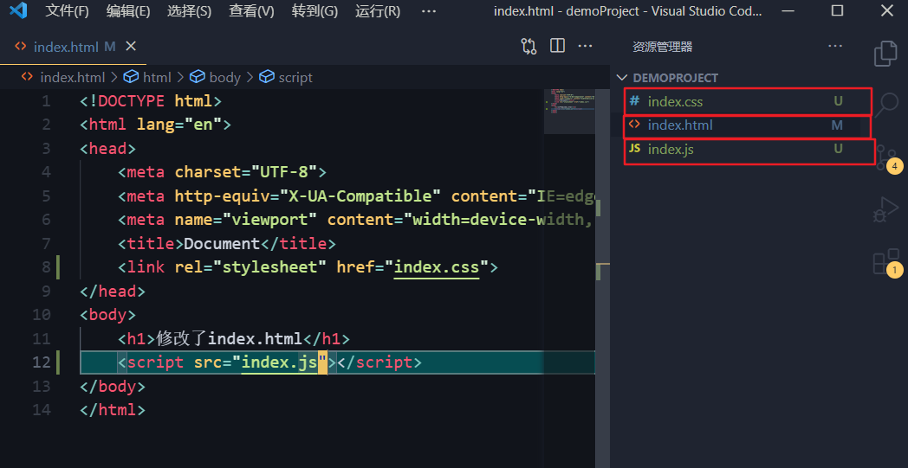

 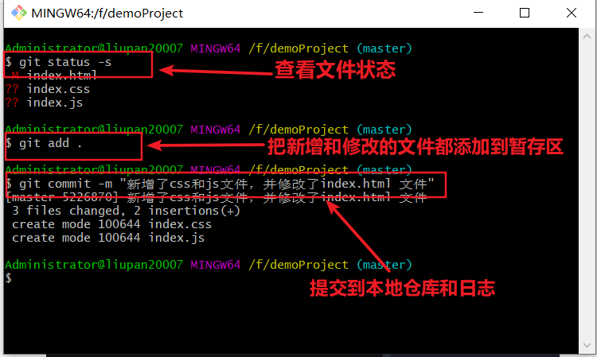

**今后在项目开发中，会经常使用这个命令，将新增和修改过后的文件加入暂存区** 

#### 取消暂存的文件

如果需要从暂存区中移除对应的文件，可以使用如下的命令：

```shell
git reset HEAD 要移出的文件名称
```

#### 跳过使用暂存区域

`Git` 标准的工作流程是 `工作区 → 暂存区 → Git 仓库` ，但有时候这么做略显繁琐，此时可以跳过暂存区，直接将工作区中的修改提交到 `Git` 仓库，这时候 `Git` 工作的流程简化为了 `工作区 → Git 仓库` 

`Git` 提供了一个跳过使用暂存区域的方式， 只要在提交的时候，给 `git commit` 加上 `-a` 选项， `Git` 就会自动把所有已经跟踪过的文件暂存起来一并提交，从而跳过 `git add` 步骤：

```shell
git commit -a -m "日志信息"
```

 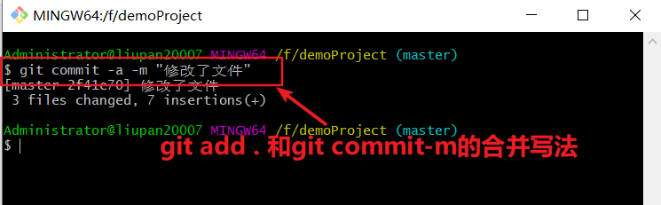

#### 移除文件

从 Git 仓库中移除文件的方式有两种：

① 从 Git 仓库和工作区中 **同时移除** 对应的文件

② 只从 Git 仓库中移除指定的文件，但保留工作区中对应的文件

```shell
# 从 Git仓库和工作区中同时移除 index.js 文件
git rm -f index.js
# 只从 Git 仓库中移除 index.css，但保留工作区中的 index.css 文件
git rm --cached index.css
```

效果如下：
 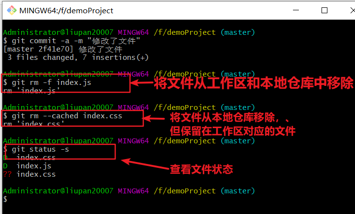

#### 忽略文件

一般我们总会有些文件无需纳入 `Git` 的管理，也不希望它们总出现在未跟踪文件列表。 在这种情况下，我们可以创建一个名为 `.gitignore` 的配置文件，列出要忽略的文件的匹配模式。

文件 `.gitignore` 的格式规范如下：

① 以 **# 开头** 的是注释

② 以 **/ 结尾** 的是目录

③ 以 **/ 开头** 防止递归

④ 以 **! 开头** 表示取反

⑤ 可以使用 **glob 模式** 进行文件和文件夹的匹配（glob 指简化了的正则表达式）

- **星号 *** 匹配 **零个或多个任意字符**

- **`[abc]`** 匹配 **任何一个列在方括号中的字符** （此案例匹配一个 a 或匹配一个 b 或匹配一个 c）

- **问号 ?** 只匹配 **一个任意字符**

- **两个星号 *** * 表示匹配 **任意中间目录** （比如 a/**/z 可以匹配 a/z 、 a/b/z 或 a/b/c/z 等）

- 在方括号中使用 **短划线** 分隔两个字符， 表示所有在这两个字符范围内的都可以匹配（比如 [0-9] 表示匹配所有 0 到 9 的数字）

#### 回退到指定的版本

```shell
# 在一行上展示所有的提交历史
git log --pretty=oneline

# 使用 git reset --hard 命令，根据指定的提交 ID 回退到指定版本
git reset --hard <CommitID>

# 在旧版本中使用 git reflog --pretty=oneline 命令，查看命令操作的历史
git reflog --pretty=onelone

# 再次根据最新的提交 ID，跳转到最新的版本
git reset --hard <CommitID>
```

 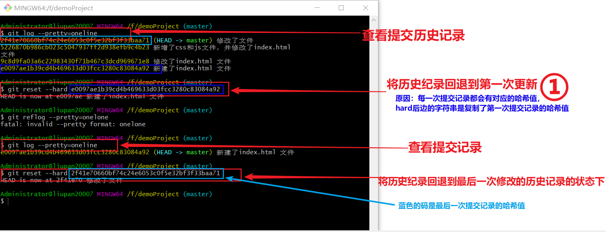

可以看到第①步执行完之后文件中的所有状态恢复为原来未修改状态
 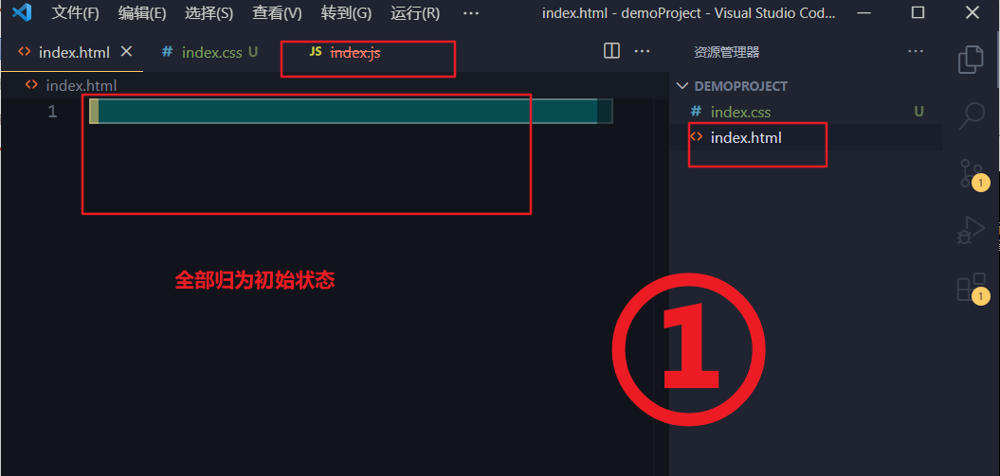

