# git教程2--远程仓库中的操作（保姆级教程，好上手)

> 原创 于 2021-11-06 01:22:04 发布 · 1.5k 阅读 · 5 · 15 · CC 4.0 BY-SA版权 版权声明：本文为博主原创文章，遵循 CC 4.0 BY-SA 版权协议，转载请附上原文出处链接和本声明。
> 文章链接：https://blog.csdn.net/TroyeSivanlp/article/details/121173204

前言：这几天学习了一下git操作，简单的给大家讲讲怎样使用。
此文章一共分为两节：

1. [git教程1–本地仓库中的操作（保姆级教程，好上手)](https://blog.csdn.net/TroyeSivanlp/article/details/121172010)

2. [git教程2–远程仓库中的操作（保姆级教程，好上手)](https://blog.csdn.net/TroyeSivanlp/article/details/121173204)

**远程仓库中的操作**

[TOC]


### 1.开源项目托管平台

专门用于免费存放开源项目源代码的网站，叫做 **开源项目托管平台** 。目前世界上比较出名的开源项目托管平台

主要有以下 3 个：

- `Github` （全球最牛的开源项目托管平台，没有之一）

- `Gitlab` （对代码私有性支持较好，因此企业用户较多）

- `Gitee` （又叫做码云，是国产的开源项目托管平台。访问速度快、纯中文界面、使用友好）

**注意：**以上 3 个开源项目托管平台，只能托管以 `Git` 管理的项目源代码，因此，它们的名字都以 `Git` 开头

### 2.什么是Gitee

Gitee是开源中国（OSChina）推出的基于Git的代码托管服务。

在 Gitee 中，你可以：

1. 汇聚优秀本土开源作者

2. 各种类型开源项目应有尽有

3. 多维指数辅助辨识开源成熟度

4. Web IDE 轻松直观浏览代码

### 3.注册

#### 3.1注册 Gitee 账号的流程

① 访问 Gitee 的官网首页 https://gitee.com/

② 点击 `注册` 按钮跳转到注册页面

③ 填写可用的用户名、邮箱、密码

④ 通过点击箭头的形式，将验证图片摆正

 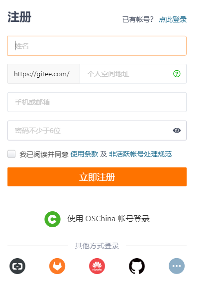

### 4.远程仓库的使用

#### 4.1新建空白远程仓库

 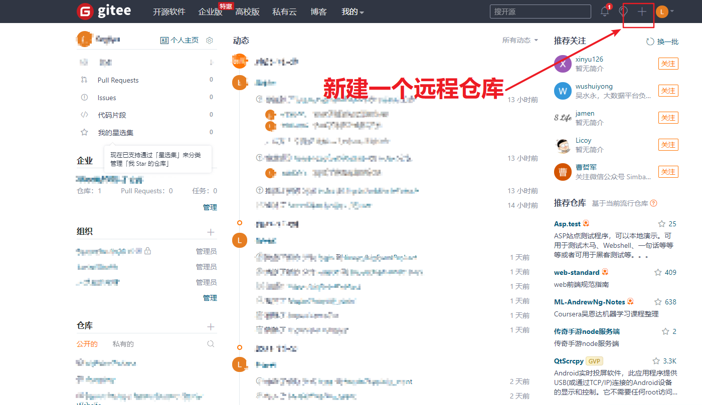

 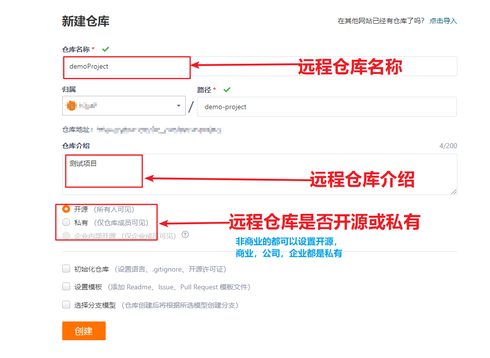

#### 4.2新建空白远程仓库成功

 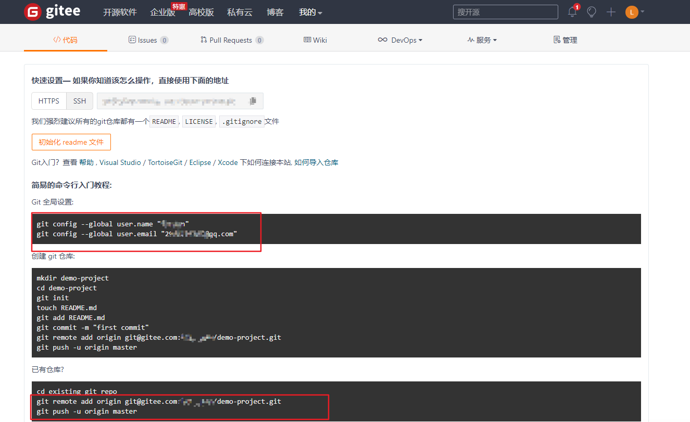

### 5远程仓库的两种访问方式

Gitee 上的远程仓库，有两种访问方式，分别是 `HTTPS` 和 `SSH` 。它们的区别是：

① `HTTPS` ： **零配置** ；但是每次访问仓库时，需要重复输入 Gitee 的账号和密码才能访问成功

② `SSH` ： **需要进行额外的配置** ；但是配置成功后，每次访问仓库时，不需重复输入 Gitee 的账号和密码

**注意：**在实际开发中， **推荐使用 SSH 的方式访问远程仓库。** 

##### 5.1基于 SSH 将本地仓库上传到 `Github` 

**注意：** `git push origin master` 也能进行提交， `git push origin -u` 的话可以提交代码，并且把 `origin` 当作默认的主机，后续直接 `git push` 就可以提交到 `origin` 对应的主机

```javascript
git remote add origin `ssh地址`
git push -u origin master
```

效果如下：
 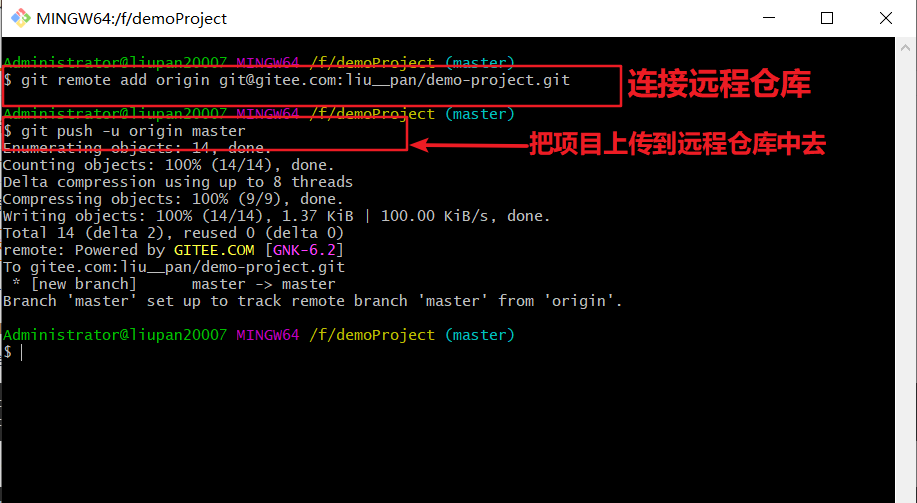

##### 5.2将远程仓库克隆到本地

打开 `Git Bash` ，输入如下的命令并回车执行：

```shell
git clone 远程仓库的地址
```

效果如下：
 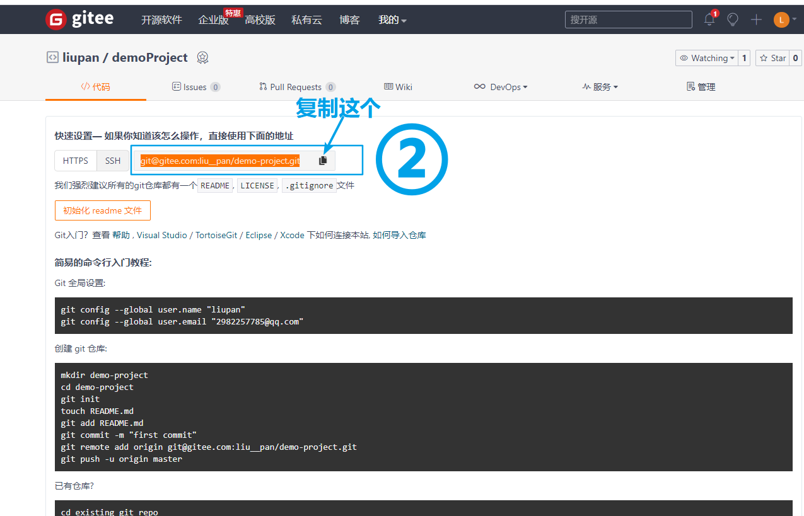

 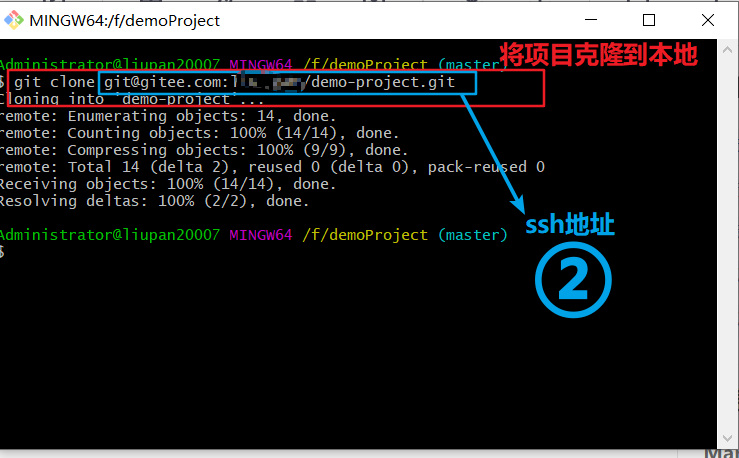

### 6.master主分支

在初始化本地 `Git` 仓库的时候， `Git` 默认已经帮我们创建了一个名字叫做 `master` 的分支。通常我们把这个 `master` 分支叫做主分支。

在实际工作中， `master` 主分支的作用是： **用来保存和记录整个项目已完成的功能代码** 。

因此， **不允许程序员直接在 `master` 分支上修改代码** ，因为这样做的风险太高，容易导致整个项目崩溃。

### 7.功能分支

由于程序员不能直接在 `master` 分支上进行功能的开发，所以就有了功能分支的概念。

**功能分支** 指的是专门用来开发新功能的分支，它是临时从 `master` 主分支上分叉出来的，当新功能开发且测试

### 8.查看分支列表(⭐⭐⭐)

使用如下的命令，可以查看当前 Git 仓库中所有的分支列表：

```shell
git branch
```

运行的结果如下所示：

[外链图片转存失败,源站可能有防盗链机制,建议将图片保存下来直接上传(img-Ay5Fxe93-1636128885323)(images/查看分支.png)]

**注意：**分支名字前面的 ***** 号表示当前所处的分支。

### 9.创建新分支

使用如下的命令，可以 **基于当前分支** ， **创建一个新的分支** ，此时，新分支中的代码和当前分支完全一样：

```
git branch 分支名称
```

效果如下：
 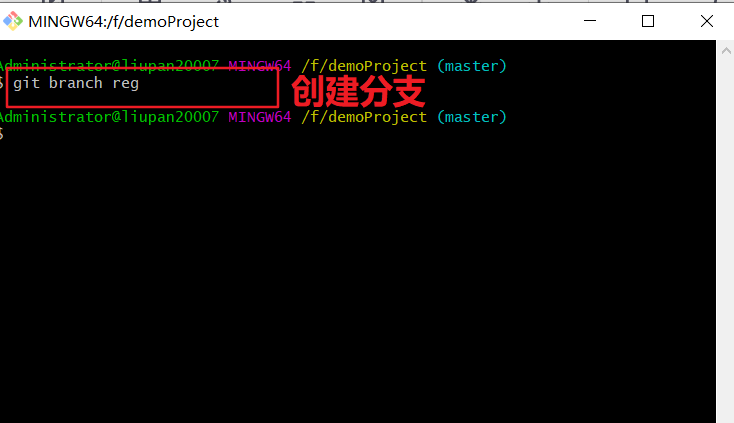

### 10.切换分支

使用如下的命令，可以 **切换到指定的分支上** 进行开发：

```shell
git checkout reg
```

 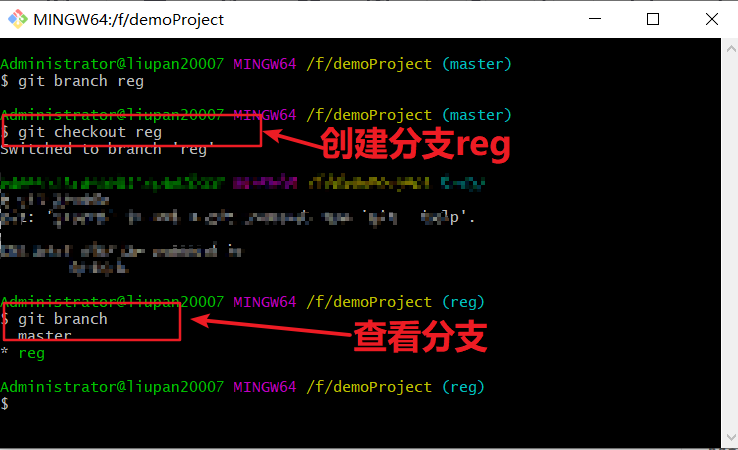

### 11.分支的快速创建和切换(⭐⭐⭐)

使用如下的命令，可以 **创建指定名称的新分支** ，并 **立即切换到新分支上** ：

```shell
# -b 表示创建一个新分支
# checkout 表示切换到刚才新建的分支上
git checkout -b 分支名称
```

图示如下：
 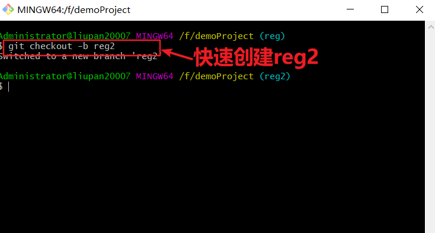

**注意：** 

“ `git checkout -b 分支名称` ” 是下面

两条命令的简写形式：

① `git branch` 分支名称

② `git checkout` 分支名称

### 12.合并分支

功能分支的代码开发测试完毕之后，可以使用如下的命令，将完成后的代码合并到 `master` 主分支上：

```shell
# 1. 切换到 master 分支
git checkout master
# 2. 在master 分支上运行 git merge 命令，将 login 分支的代码合班到 master 分支
git merge login
```

图示如下：

 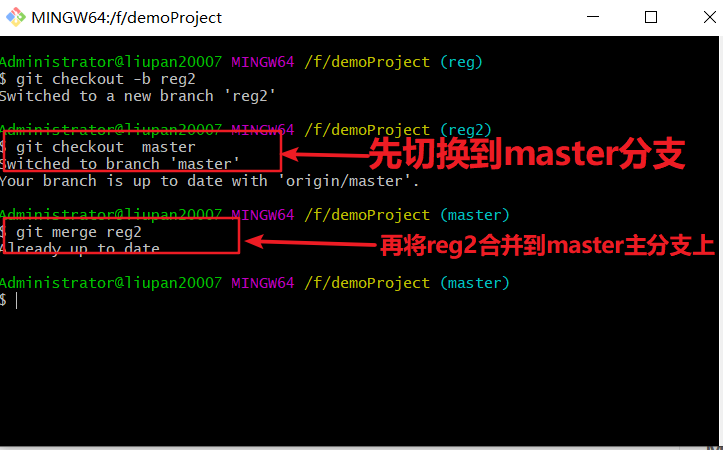

**合并分支时的注意点** ：

假设要把 C 分支的代码合并到 A 分支，

则必须 **先切换到 A 分支** 上， **再运行 git merge 命令** ，来合并 C 分支！

### 13.删除分支

当把功能分支的代码合并到 `master` 主分支上以后，就可以使用如下的命令，删除对应的功能分支：

```shell
git branch -d 分支名称
```

图示如下：
 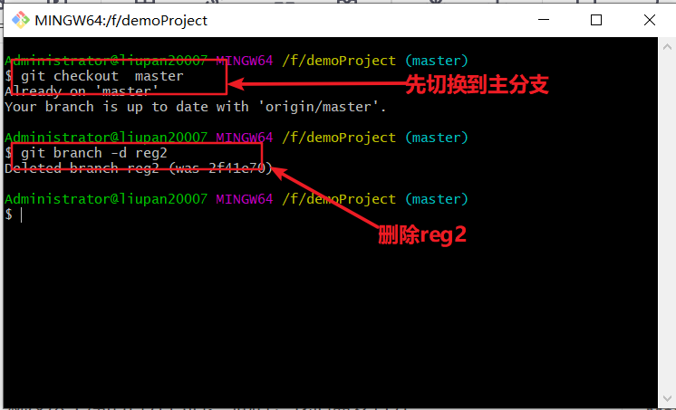

### 14.遇到冲突时的分支合并

如果 **在两个不同的分支中** ，对 **同一个文件** 进行了 **不同的修改** ，Git 就没法干净的合并它们。 此时，我们需要打开

这些包含冲突的文件然后 **手动解决冲突** 。

```shell
# 假设：在把 reg 分支合并到 master 分支期间
git checkout master
git merge reg

# 打开包含冲突的文件，手动解决冲突之后，再执行如下命令
git add .
git commit -m "解决了分支合并冲突的问题"
```

 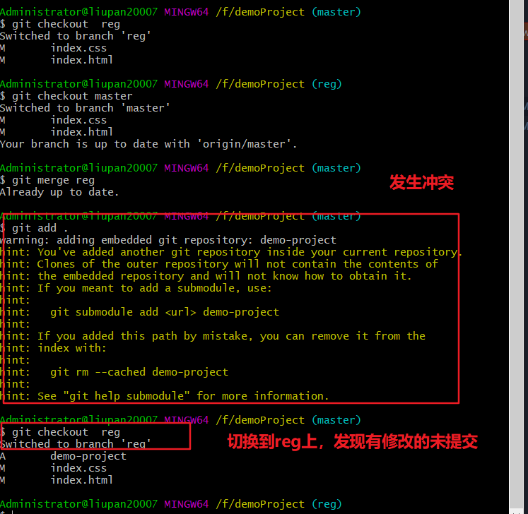

 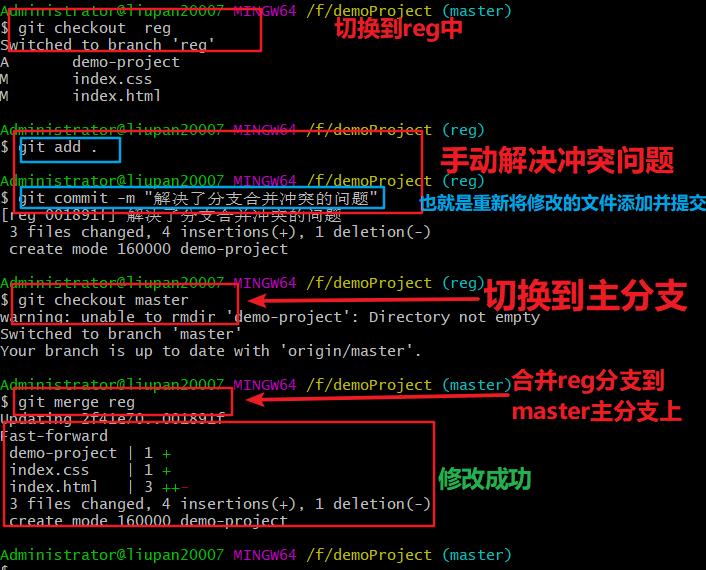

### 15.将本地分支推送到远程仓库(⭐⭐⭐)

如果是 **第一次** 将本地分支推送到远程仓库，需要运行如下的命令：

```shell
# -u 表示把本地分支和远程分支进行关联，只在第一次推送的时候需要带 -u 参数
git push -u 远程仓库的别名 本地分支名称:远程分支名称

# 实际案例
git push -u origin payment:pay

# 如果希望远程分支的名称和本地分支名称保持一致，可以对命令进行简化
git push -u origin payment
```

 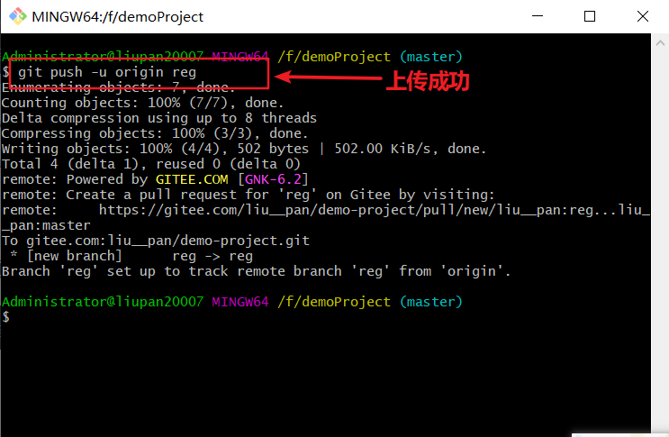

**注意：**第一次推送分支需要带 **-u 参数** ，此后可以直接使用 `git push` 推送代码到远程分支。

### 16.查看远程仓库中所有的分支列表

通过如下的命令，可以查看远程仓库中，所有的分支列表的信息：

```shell
git remote show 远程仓库名称
```

### 17.跟踪分支(⭐⭐⭐)

跟踪分支指的是：从远程仓库中，把远程分支下载到本地仓库中。需要运行的命令如下：

```shell
# 示例
git checkout pay

# 从远程仓库中，把对应的远程分支下载到本地仓库，并把下载的本地分支进行重命名
git checkout -b 本地分支名称 远程仓库名称/远程分支名称

# 示例
git checkout -b payment origin/pay
```

### 18.拉取远程分支的最新的代码

可以使用如下的命令，把远程分支最新的代码下载到本地对应的分支中:

```shell
# 从远程仓库，拉取当前分支最新的代码，保持当前分支的代码和远程分支代码一致
git pull
```

效果如下：
 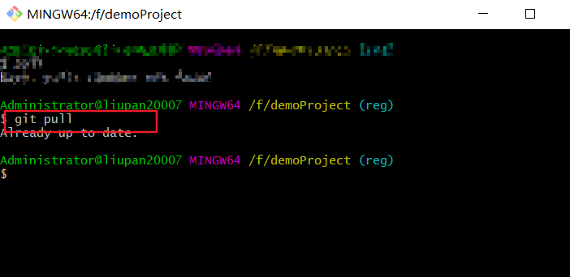

### 19.删除远程分支

可以使用如下的命令，删除远程仓库中指定的分支：

```shell
# 删除远程仓库中，制定名称的远程分支
git push 远程仓库名称 --delete 远程分支名称

# 示例
git push origin --delete pay
```

## 总结

- 能够掌握 `Git` 中基本命令的使用

  - `git init`

  - `git add .`

  - `git commit –m "提交消息"`

  - `git status` 和 `git status -s`

- 能够使用 `Github` 创建和维护远程仓库

  - 能够配置 `Github` 的 `SSH` 访问

  - 能够将本地仓库上传到 `Github`

- 能够掌握 `Git` 分支的基本使用

  - `git checkout -b 新分支名称`

  - `git push -u origin 新分支名称`

  - `git checkout 分支名称`

  - `git branch`

